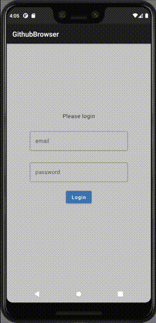

# Github Browser

This app features a login and browsing of repositories via the Github API.

Its purpose is to be a Android MVVM pattern skeleton app when starting a new project.

# Table of contents

* [Requirements](#requirements)
* [Setup](#setup)
* [Architecture Components](#architecture)
* [Test coverage](#testcoverage)
* [Licence](#Licence)
* [Original project](#original)

### Requirements

* Android Studio 2020.3.1+
* Android 5+

### Setup

* Create a GitHub personal access token with at least repo read access [here](https://github.com/settings/tokens/) 
* Run LoginActivity.kt
* Enter your username and personal access token to see the repo list.

### Architecture Components {#architecture}

* **Jetpack Compose**: @Composable functions are used to define and update the UI.
* **MVVM pattern**: ViewModels are used from androidx lifecycle packages. View reads LiveData from the ViewModel.
* **Koin dependency injection**
* **Room database**
* **Volley network client**

### Test coverage {#testcoverage}

* Instrumentation tests using MockWebServer assure that login and repo list views will be visible to the user.
* Unit tests test that repositories read, fetch and store data.

#### Run tests
`./gradlew test && ./gradlew cAT`

### Contributing

Please make a pull request

### License

MIT

### Original project {#original}

The original project with XML layouts is in [tt-github-browser](https://github.com/tonisives/tt-github-browser) repository.

